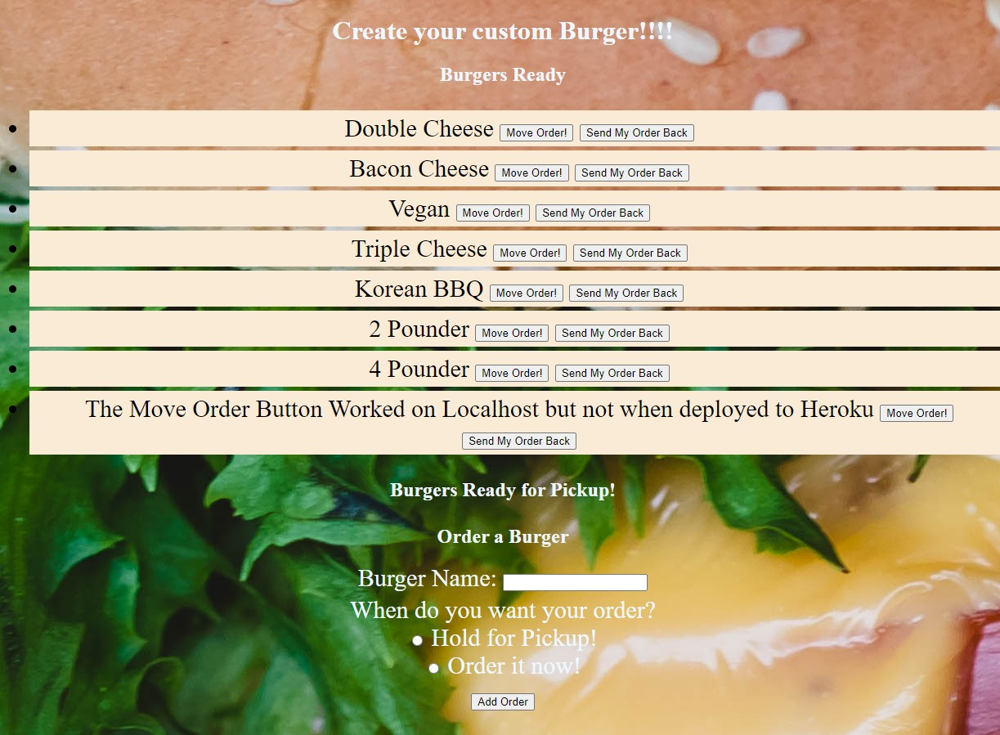
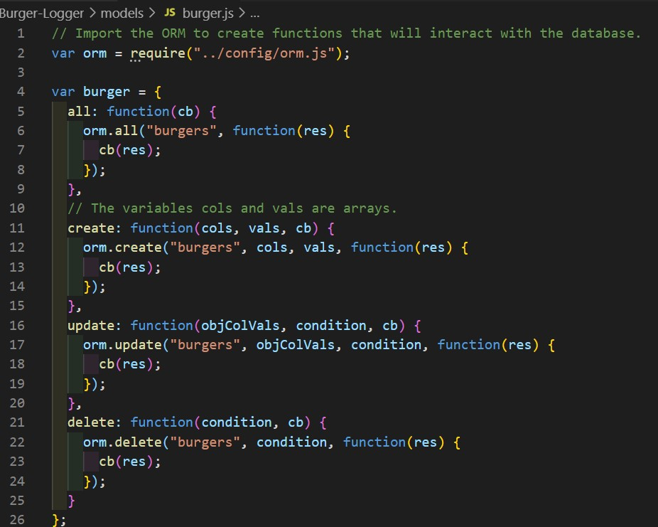

  # Burger Logger

  

  # Description
  A burger logger with MySQL, Node, Express, Handlebars and a homemade ORM

  #Table of Contents
  * [Installation](#installation)
  * [TableOfContents](#tableOfContents)
  * [Installation](#installation)
  * [Usage](#usage)
  * [Image](#image)
  * [Video](#video)
  * [License](#license)
  * [Tests](#tests)
  * [Questions](#questions)
  
  # Installation

  Must have the following installed: mysql, express, express-handlebars

  
  # Usage

* Eat-Da-Burger! is a restaurant app that lets users input the names of burgers they'd like to eat.

* Whenever a user submits a burger's name, your app will display the burger on the left side of the page -- waiting to be devoured.

* Each burger in the waiting area also has a `Devour it!` button. When the user clicks it, the burger will move to the right side of the page.

* Your app will store every burger in a database, whether devoured or not.

  
  # Images

  
  
  

  
  # License

  Shareware

  # Tests

  

  
  # Questions

  

  [Link to my GitHub](https://github.com/whiterice2020)

  If you have any quesitons, you can email me at github@delpadre.xyz

